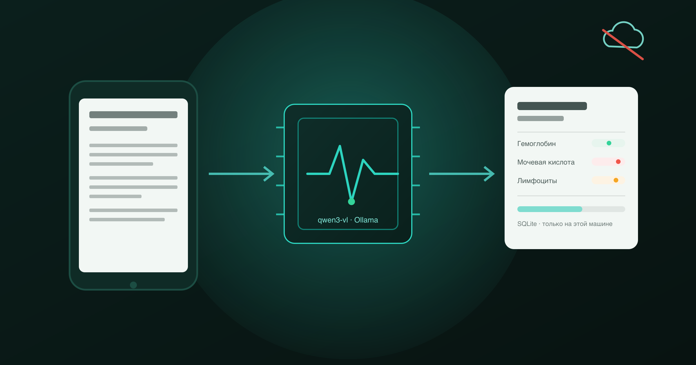
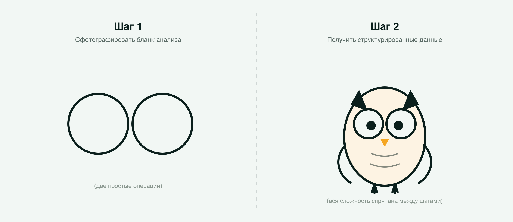
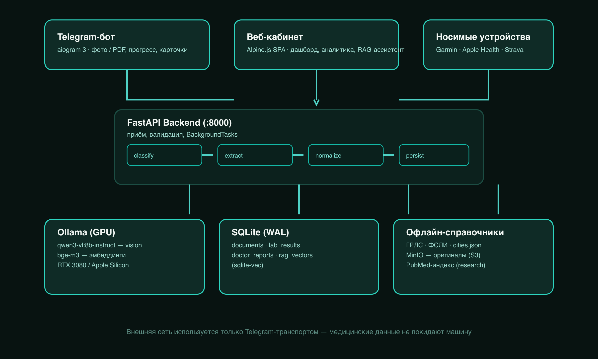
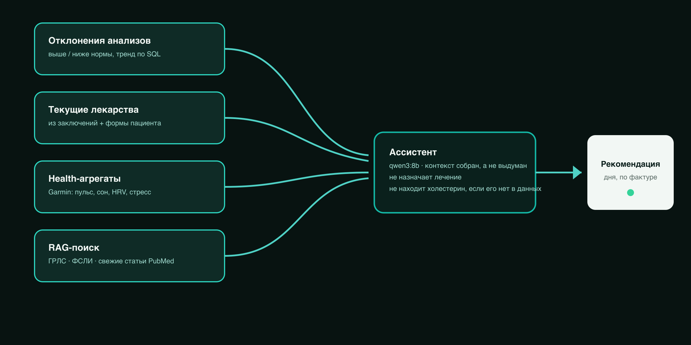
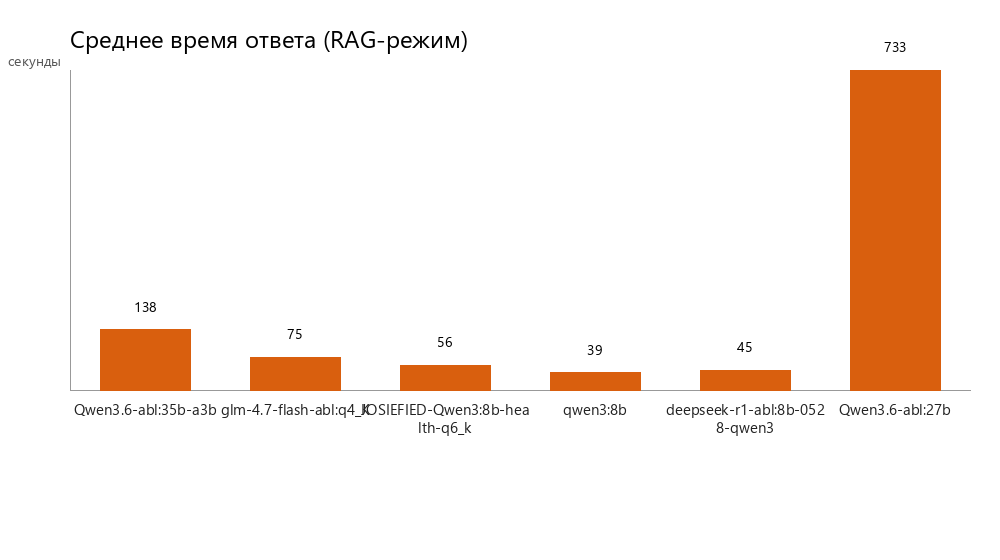
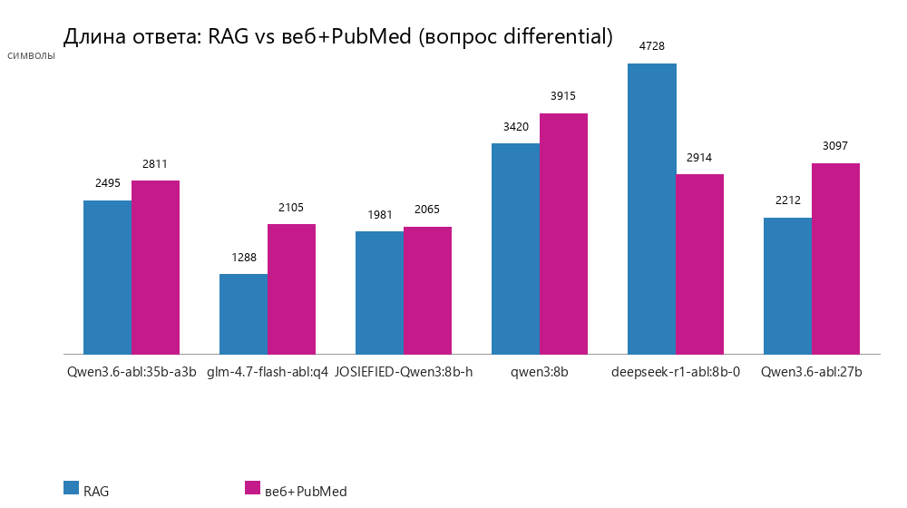
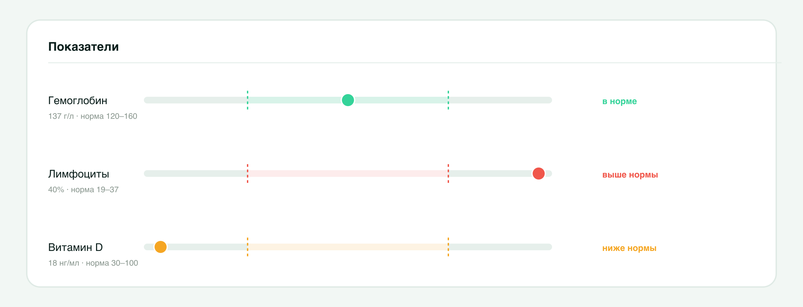

# Боткин: врач, который живёт на видеокарте и никому не звонит домой

Скажу как есть: у меня скопилось полтора года анализов крови, десяток заключений невролога и месяц данных с фитнес-браслета, и в какой-то момент я поймал себя на мысли, что мне физически неприятно загружать всё это в облачный чат-бот. Не потому что я такой принципиальный борец за приватность — просто не хочу, чтобы мой креатинин и список назначенных антидепрессантов стали строчкой в чьём-то датасете для следующей версии модели.

Так что я сделал то, что в такой ситуации обычно делает разработчик: не пошёл к врачу, а написал бота.



Дальше — история о том, как из этой в общем-то разумной идеи выросли Telegram-бот, веб-кабинет, RAG на медицинских справочниках, синхронизация с Garmin и шесть раз переставленная архитектура распознавания. Заодно — о том, как мой собственный «надёжный» код соврал про мою мочевую кислоту, а нейросеть без цензуры это заметила. С таблицами, цифрами, граблями и ссылками на всё, что можно скачать и повторить самому.

Название — не для солидности. Сергей Петрович Боткин — тот самый врач, чьим именем в России называют гепатит А и одну из старейших московских больниц; он одним из первых в стране начал системно вести истории болезни и смотреть на пациента в динамике, а не по одному анализу за раз. Идея бота ровно та же. Только вместо клинической проницательности — видеокарта, которая полтора месяца не успевала остыть.

## TL;DR — если вы дальше не пойдёте

> - Telegram-бот и веб-кабинет принимают фото или PDF анализа, распознают его vision-моделью прямо на домашней видеокарте и кладут структурированные данные в SQLite. Наружу уходит только сам файл — через Telegram как транспорт; медицинские данные с диска никуда не отправляются.
> - На тестовом стенде из 34 реальных документов — 34 из 34 успешных разборов, 100% совпадение показателей с эталоном, 27 секунд на документ. До оптимизации на отдельных бланках уходило больше семи минут.
> - Названия лекарств и анализов сверяются с офлайн-копиями двух государственных реестров (ГРЛС и ФСЛИ, почти 27 тысяч позиций на двоих): опечатки распознавания исправляются, а всё, что не похоже ни на одну известную запись, не подменяется из вежливости — остаётся как в документе.
> - Есть RAG на справочниках и свежих публикациях PubMed, синхронизация с Garmin, Apple Health и Strava, погода и геомагнитная обстановка в контексте рекомендаций дня — и гороскоп, но это скорее для настроения, чем для науки.
> - Через тот же пайплайн прогнаны шесть разных LLM без цензуры на полной истории болезни одного пациента. По дороге модель поймала баг в моём «надёжном» детерминированном коде — том самом, который я меньше всего подозревал во лжи.
> - Больше 480 тестов, Docker Compose, многопользовательский кабинет с ролями и один честно найденный (и закрытый) XSS.

## Зачем это всё, если можно просто спросить у ChatGPT

Потому что результаты анализов, выписки и заключения — это персональные данные специальной категории (152-ФЗ, статья 10, туда же попадают любые сведения о здоровье). Отправлять их в облачный OCR или сторонний LLM-API — с точки зрения закона отдельный разговор о согласиях и хранении, а с чисто человеческой точки зрения просто неприятная идея, даже если абстрагироваться от буквы закона.

При этом сами данные никуда не деваются: дома у почти любого человека копятся PDF из лабораторий и сфотографированные бланки из районной поликлиники, у показателей есть динамика, которую хочется видеть глазами, а не бегать по переписке с терапевтом в поисках старого файла.

Отсюда — архитектурное ограничение, зафиксированное до первой строчки кода и с тех пор не пересматривавшееся: весь разбор документа происходит локально. Vision-модель крутится в Ollama на домашней видеокарте, справочник лекарств — офлайн-файл в репозитории, база — один файл SQLite. Внешняя сеть нужна ровно одному компоненту, Telegram, и то только как транспорту, по которому пользователь разговаривает с собственным ботом на собственном железе.

Дальше в тексте будет достаточно техники, чтобы утомить даже терпеливого читателя. Поэтому прежде, чем начнутся детали, — то, что должно остаться в голове у человека, который просто хочет понять, что это вообще такое.

## Как это работает, если вам не важны детали

Двумя словами: фотография превращается в строчку таблицы.

Чуть подробнее: пользователь присылает боту фото или PDF — анализ, заключение врача, справку. Бот передаёт файл backend'у на FastAPI, тот сохраняет его и запускает обработку в фоне. Дальше документ проходит четыре шага, которые так и называются в коде: `classify → extract → normalize → persist`.

- **classify** — модель смотрит на первую страницу и решает, что перед ней: анализ, заключение врача или что-то нераспознанное.
- **extract** — модель читает документ и достаёт из него данные: показатели анализов с единицами и нормами, либо диагноз, жалобы, рекомендации и назначения из заключения.
- **normalize** — сырой текст, который вернула модель, приводится к общему виду: даты — в один формат, единицы измерения — к канону, названия лекарств и анализов сверяются с государственными справочниками.
- **persist** — результат сохраняется в SQLite, а бот присылает карточку с итогом. До этого пользователь смотрит на прогресс-бар, который честно показывает, на какой из четырёх стадий обработка сейчас застряла.

Если бы весь пайплайн описывался этими четырьмя глаголами, статьи бы не было — задача закрылась бы за выходные. Но, как обычно и бывает, каждый из четырёх глаголов внутри оказался отдельным маленьким адом, и почти всё, что дальше, — про это.

Есть старый мем про то, как рисовать сову: шаг первый — нарисуйте два круга, шаг второй — нарисуйте сову. Ровно так на старте выглядела архитектура распознавания: шаг первый — сфотографировать бланк, шаг второй — получить структуру. Всё интересное было аккуратно спрятано внутри перехода между шагами.





Сова в итоге нарисовалась. Но сначала пришлось разобраться, почему видеокарта в соседней комнате грелась так, будто майнит биткоин, а не читает бланк с холестерином.

## 450 секунд на бланк — это не баг, это опыт

Когда пайплайн из предыдущей главы наконец заработал, выяснилось неприятное: обработка одного документа занимала от 38 до 450 секунд. Полминуты — терпимо. Семь с лишним минут на бланк с двадцатью показателями — уже нет, особенно если это должно быть похоже на продукт, а не на демонстрацию терпения.

Смотреть на медленную видеокарту — довольно медитативное занятие, но продукту это не помогает, так что вместо медитации пришлось заняться систематическим разбором. План был предельно приземлённый: замерить сырую скорость на голом API Ollama при разных настройках, поднять исторические данные e2e-тестов, сравнить Ollama внутри WSL2 с нативной Windows-сборкой — и дальше чинить одно изменение за раз, каждый раз прогоняя тесты и сравнивая с предыдущим результатом. Никаких «поменял всё сразу и надеюсь на лучшее».

Первый же прогон разложил проблему на шесть причин, из которых три оказались откровенно глупыми.

**`num_predict=16384`.** Этот параметр — потолок токенов, которые модель имеет право сгенерировать за один ответ. Условно говоря, модели выдали лицензию написать роман, а попросили дать справку. При скорости 21–40 токенов в секунду 16384 токена — это 410–780 секунд чистого времени, даже если реальный ответ занимает от силы восемьсот. Медицинский бланк с двадцатью показателями превращается в JSON на 500–800 токенов, а не в философский трактат.

**`num_ctx=16384`.** Размер контекстного окна напрямую бьёт по скорости генерации: чем больше окно, тем больше KV-кэша нужно перелопачивать на каждый токен. Замер показал честные 15% замедления при переходе с 4096 на 16384 — а для одностраничного документа с полутора тысячами токенов промпта такой запас попросту не нужен.

**`temperature=0.3`.** Небольшая случайность в генерации — штука, полезная для творческого письма и вредная для задачи «прочитай бланк и верни те же самые числа, что там написаны». На одном и том же документе модель то находила показатель ROMA, то не находила — и это не мистика, а прямое следствие того, что при температуре выше нуля один и тот же вход не обязан давать один и тот же выход.

Три оставшиеся причины были менее очевидны и куда интереснее. Vision-вызовы и текстовые вызовы использовали разные `num_ctx`, и Ollama при каждой смене контекста честно перезагружала модель — пять-восемь секунд впустую на каждый переход между двумя типами запросов. Сама Ollama внутри WSL2 была версии 0.24.0, тогда как нативная Windows-сборка уже подтянула актуальную 0.30.11 с обновлённым `llama.cpp`. А WSL2 как таковой добавлял накладные расходы: по независимым бенчмаркам — 10–13% к времени ответа просто за счёт виртуализации сети и диска.

Переезд с WSL2 на нативную Windows-версию Ollama дал прямой доступ к CUDA, снял необходимость городить workaround с автоопределением IP-адреса WSL2 (о котором будет отдельный абзац дальше) и попутно избавил от версионного долга. По кривой из бенчмарков ожидалось процентов десять-тринадцать прироста. По факту на одном и том же документе получилось так:

| Прогон | Состояние | Extract, с | Результат |
|---|---|---|---|
| холодный старт | модель не в VRAM | 110,3 | 3 из 3 |
| тёплый | второй запуск | 10,9 | 2 из 3 (не нашёлся ROMA) |
| тёплый | третий запуск | 10,6 | 3 из 3 |

Для сравнения, тот же самый бланк на WSL2 в тёплом режиме занимал 38,4 секунды. Разница в 3,6 раза — заметно больше, чем обещанные бенчмарками 10–13%, и разница эта объясняется не столько самим WSL2, сколько тем, что заодно подтянулась версия Ollama. А нестабильность второго прогона (2 из 3 вместо 3 из 3) — тот самый эффект `temperature=0.3`, который будет починен на следующем шаге.

Дальше — уже методично, шаг за шагом, каждый раз с полным прогоном тестов на реальном документе:

1. `temperature` для извлечения — с 0,3 до 0,0. Скорость не изменилась (10,8–11,1 с против 10,6 с — в пределах погрешности), но результат стал воспроизводимым: два прогона из двух прошли одинаково, вместо одного из двух раньше.
2. Сравнение `qwen3-vl:8b-instruct` с вариантом `8b-thinking` — тем же весом, но с цепочкой рассуждений перед ответом. Thinking-версия оказалась медленнее в 5–6 раз (57–63 секунды против 10,6) при том же самом наборе найденных значений. Для задачи «прочитать бланк и вернуть JSON» размышлять особо не о чём: текстовый слой документа и так точен, рассуждения — чистый оверхэд. Именно поэтому в README жирным шрифтом написано скачивать `instruct`, а не `thinking`-вариант — это не вкусовое предпочтение, а прямое следствие вот этого замера.
3. `num_predict` — с 16384 до 4096. На простых документах эффекта почти не было (модель и так не генерировала больше пары сотен токенов), но на бланках с длинным выводом это стало страховкой от той самой ситуации, когда модели выдают лицензию на роман.
4. `num_ctx` — с 16384 до 8192. Ещё пятнадцать процентов к скорости генерации и три секунды с загрузки модели.
5. Прогрев модели фоном при старте сервиса. Холодная загрузка весов в VRAM занимает 100–120 секунд, и раньше этот штраф платил первый же документ после перезапуска бота. Простой фоновый вызов `/api/generate` с пустым промптом и правильными `num_ctx`/`keep_alive` решает это без блокировки старта — если Ollama недоступна, сервис просто логирует это и живёт дальше.

По дороге всплыла отдельная неприятность: на новой версии Ollama модель периодически отдавала пустой, но формально валидный JSON `{"results": [], "tests": []}` за 1,3–1,5 секунды — подозрительно быстро для настоящего вызова модели. Гипотез было три: сломался механизм принудительной генерации по грамматике (XGrammar), температура попадала в локальный минимум, или `keep_alive` тащил за собой испорченный кэш между вызовами. Ни перезапуск Ollama, ни понижение температуры проблему не убрали до конца — она вернётся в статье ещё раз, уже с решением, потому что здесь её только диагностировали.

Когда стало ясно, что параметрами дело не ограничивается, встал вопрос выбора модели как таковой. Тестовый стенд из 34 реальных документов прогнали через четыре кандидата на роль основной vision-модели:

| Модель | Размер | Точность | Доля успешных документов | Среднее время | Итоговый счёт |
|---|---|---|---|---|---|
| **qwen3-vl:8b-instruct** | 6,1 ГБ | **320/325 (98,5%)** | **88%** | 50,6 с | **0,0172** |
| minicpm-v:8b | 5,5 ГБ | 219/323 (67,8%) | 53% | **26,3 с** | 0,0137 |
| gemma4:latest | 9,6 ГБ | 241/303 (79,5%) | 41% | 67,8 с | 0,0048 |
| qwen3-vl:30b-a3b | 19 ГБ | 38/66 (57,6%)* | 50%* | 283,8 с* | 0,0010 |

*Замер для 30B-версии частичный: 19 гигабайт веса не помещаются в 16 гигабайт видеопамяти, 22% модели уходит на CPU, и прогон на восьми из тридцати четырёх документов остановили — полный занял бы около трёх часов.

Итоговый счёт считался как произведение точности на долю успешных документов, делённое на среднее время — попытка одной цифрой уравновесить «правильно» и «быстро». `qwen3-vl:8b-instruct` обошла ближайшего конкурента по этому счёту в 1,26 раза, а самую медленную и большую модель — в 17 раз. Отдельно занятно смотрится minicpm-v: она в два раза быстрее лидера, но 16 из 34 документов у неё падали — либо из-за неверной классификации типа документа, либо из-за пустого извлечения там, где показатели точно были. Быстрый неправильный ответ на медицинских данных не считается быстрым ответом.

С самой быстрой моделью на руках можно было бы остановиться, но 30 из 34 — это ещё не готовый продукт: значит, четыре документа стабильно падали, и именно они стали следующей главой этой истории.

## Четыре сломанных документа, четыре разных диагноза

Хорошая новость в том, что у всех четырёх падений оказались разные корни. Плохая — что для этого пришлось лезть в каждый отдельно, потому что универсального фикса на все случаи не существует.

Первый бланк — анализ на онкомаркеры — падал загадочнее прочих. Модель отвечала за 1,3 секунды, что подозрительно быстро для настоящего вызова vision-модели, и возвращала пустой, но формально корректный по схеме список показателей. Это тот самый баг с пустым JSON, который был диагностирован, но не вылечен в предыдущей главе. Причина оказалась в XGrammar — механизме, который заставляет модель выдавать JSON строго по схеме. На плотной картинке он иногда «схлопывает» вывод в пустой, но валидный объект — грамматика соблюдена, смысла нет. Лечится это довольно грубым, но рабочим способом: если вызов со строгой схемой вернул ноль строк, повторяем тот же запрос без принудительной грамматики. Без неё модель пишет свободный JSON, а библиотека `instructor`, которая всё равно валидирует ответ по Pydantic-схеме, приводит его к нужному виду. Это и называется adaptive fallback — страхуемся вторым проходом только тогда, когда первый явно провалился, а не всегда.

Второй бланк — анализ мочи — терял ровно один показатель, потому что две строки таблицы склеились в одну: «pH мочи» и «Относительная плотность» физически лежали на одной строке текстового слоя документа. Старый парсер брал только первый показатель из склеенной строки. У этой истории обнаружилась смешная деталь: функция, которая склеивает разбитые пробелом тысячи («1 010» → «1010»), с той же радостью склеивала «5.5» и «5» в «5.55» — потому что оба варианта одинаково хорошо подходили под регулярное выражение «просто число». В итоге второй показатель строки исчезал ещё до того, как до него доходил парсер. Починили тем, что ограничили склейку только целыми числами: «1 010» превращается в «1010», а «5.5 5» остаётся двумя отдельными токенами, то есть двумя значениями. Универсальный урок отсюда: любое «магическое» регулярное преобразование, написанное под один частный случай, почти гарантированно ломает другой случай, который выглядит похоже, но по смыслу — другое число. Как только замечаете такое преобразование в коде — сразу заводите тест на оба варианта входа, а не на тот, который вас в данный момент беспокоит.

Третий бланк — общий анализ крови с двадцатью показателями — терял одно значение (СОЭ) и не самым очевидным образом. Первая гипотеза звучала логично: vision-модель просто не видит строчку внизу растрового бланка. На неё потратили время, пытаясь заставить модель разглядеть нижнюю часть изображения — а документ продолжал падать. Оказалось, что после стабилизации остальных фиксов он начал падать по совершенно другой причине: этап классификации типа документа возвращал `doctor_report` вместо `analysis`, и извлечение показателей вообще не запускалось — просто не до чего было извлекать. Прогон одного и того же вызова классификации четыре раза подряд дал `doctor_report` один раз из четырёх, причём с уверенностью 1,0 — модель ошибалась уверенно, что хуже, чем ошибаться неуверенно. Решение оказалось не в том, чтобы играть с температурой, а в том, чтобы поймать эту ошибку детерминированным правилом: модель стабильно извлекала верный заголовок документа, «Общий анализ крови», а документ с таким заголовком является анализом по определению. Список однозначных лабораторных заголовков в код — и пять прогонов из пяти стали давать правильный тип. Мораль этой истории отдельная: когда документ «мигает» между успехом и провалом без единой правки кода, первым делом смотрите, на каком именно шаге он падает сейчас, а не чините гипотезу из предыдущей сессии по памяти.

Четвёртый бланк был самым скучным — просто на двадцати показателях с длинными латинскими названиями лимит `num_predict=2048` не хватал, и модель обрывалась на середине таблицы. Поднятие лимита до 4096 закрыло вопрос без побочных эффектов.

После всех четырёх фиксов тестовый стенд из 34 документов прошёл полностью, 34 из 34, точность — 325 из 325 найденных значений, среднее время — 27,1 секунды на документ вместо 50,6. Число «100%» здесь честное, но с одной оговоркой, которую стоит проговорить прямо: в промежуточном прогоне, до фикса классификации, знаменатель был меньше — 305 из 305, — просто потому, что упавший на этапе classify документ не доходил до сверки вообще, и его 20 показателей не участвовали в статистике ни как правильные, ни как неправильные. После фикса документ участвует в сверке полностью и даёт все 20 из 20, отсюда и итоговые 325 из 325. Это к разговору о том, что «100% точности» без знания, как считался знаменатель, — цифра, которую легко процитировать неправильно.

Отдельным пунктом это стоило одного код-ревью после всех фиксов, которое вскрыло мёртвую и сломанную ветку «гибридного fallback»: если лёгкая текстовая модель возвращала ноль строк, код пытался повторить запрос через vision-модель — только эта ветка падала с `NameError`, потому что ссылалась на константы, которые никто не импортировал в модуль. Тесты этого не ловили, потому что условие для входа в ветку было заведомо ложным в боевом конфиге. Классический мёртвый код: не исполняется и одновременно содержит баг, который ждёт своего часа. Убрали целиком, вместе с пятью строками тернарных выражений вокруг него. Оптимизацию всегда стоит закрывать отдельным ревью — часть «фиксов» неизбежно оказывается техническим долгом, который сам себя не найдёт.

## Справочник, который лечит опечатки, а не придумывает диагнозы

Распознанное моделью название лекарства или анализа — не то же самое, что название, которое реально можно положить в базу и потом искать по нему. VLM видит «Элкап» там, где написано «Элькар», или «Глюкоэа» там, где напечатано «Глюкоза», — не потому что модель плохая, а потому что почерк врача и качество телефонной камеры делают своё дело. Значит, распознанные названия нужно сверять со справочником — но справочник в медицинском проекте страшнее, чем кажется на первый взгляд, потому что у него есть способ незаметно начать врать.

Первый справочник — государственный реестр лекарственных средств, ГРЛС, почти 21 тысяча названий: торговые наименования и международные непатентованные, со статусами регистрации и номерами регистрационных удостоверений. Матчинг сырого имени со справочником сделан через RapidFuzz, но конкретный выбор метрики — не случайный. В качестве меры близости используется абсолютная дистанция Дамерау-Левенштейна, а не что-то более продвинутое вроде `WRatio` или JaroWinkler, и выбор проверен замером на всём словаре из 21 тысячи имён: типичная OCR-ошибка в названии лекарства — это расстояние в одну-три буквы, и абсолютная дистанция ставит правильный ответ первым, тогда как более «умные» метрики на большом словаре чаще дают ложные совпадения. К этому добавлены два порога: относительный потолок дистанции, зависящий от длины имени (короткие имена матчатся строже — иначе любые три буквы совпадут с чем угодно), и минимальный процент сходства как отдельная защита. Не прошло порог — имя не подменяется вообще, остаётся как в документе со статусом `unverified`. Это осознанное решение: редкий или незнакомый препарат не «исправляется» до похожего — это защита от ятрогенной, то есть спровоцированной самим лечением, ошибки. Лучше показать врачу сырое, необработанное имя, чем уверенно подсунуть чужое лекарство, которое просто оказалось на нужном расстоянии по Левенштейну.

Второй справочник — ФСЛИ, Федеральный справочник лабораторных исследований — оказался куда капризнее, и на нём разыгралась целая маленькая сага, потому что первая версия «просто скопировала архитектуру ГРЛС» — и просчиталась.

Первая версия сборки справочника из официальной выгрузки выдала «Записано 0 тестов» при ожидаемых почти двадцати одной тысяче. Как это часто бывает с госвыгрузками, дело было не в коде, а в самом файле: `openpyxl` в режиме потокового чтения брал размеры листа из сохранённых в файле метаданных, а выгрузка записала туда `A1:A1` вместо реальных `A1:R20729` — то есть библиотека честно верила файлу, а файл лгал. Никакой ошибки при этом не бросалось, просто читалась одна ячейка «ID» и всё заканчивалось. Тихий провал без единой строчки в логе — самый неприятный тип бага. Отдельно там же обнаружилась двойная шапка: первая строка с машиночитаемыми именами колонок, вторая — с человекочитаемыми описаниями, и план, рассчитанный на шапку в одной строке, разошёлся с реальностью на старте.

Когда справочник наконец собрался, всплыла куда более интересная и куда более медицинская проблема. Карточка документа начала показывать «Гемоглобин, массовая концентрация в моче с помощью тест-полоски» там, где в PDF было написано просто «Гемоглобин». Нормализатор брал из справочника полное имя записи — с указанием биоматериала и метода измерения — а фаззи-матч на большом словаре синонимов иногда выбирал случайную запись из десятков вариантов одного и того же показателя. «Эритроциты» превращались в «эритроциты в цереброспинальной жидкости», «Тромбоциты» — в «CD31+клетки» (потому что это оказался синоним совсем другого, но похожего по названию теста), и в довесок к этому единица измерения бралась из этой же случайно выбранной, чужой записи, что плодило ложные предупреждения о несовпадении единиц.

Разница между «справочник-корректор» и «справочник-обогатитель» здесь принципиальна. Справочник может исправить опечатку — но не имеет права дописывать в карточку то, чего не было в исходном документе: биоматериал, метод, локализацию. Решение было архитектурным, а не косметическим: справочник целиком пересобрали, свернув с двадцати с лишним тысяч отдельных записей на биоматериал и метод до **6211 показателей** — одна запись на один показатель, инвариантная к тому, где и как его измеряли. Дальше — уже мельче: точное каноническое имя всегда обязано побивать чужой синоним (иначе «тромбоциты» как синоним другого теста воровал бы у настоящих «Тромбоцитов» их собственное имя), а составные записи вида «Альбумин; Креатинин» (в справочнике реально нашлось 287 таких строк, где несколько аналитов слеплены в одну запись) вообще выкидывались из индекса — лучше честно показать нераспознанное имя, чем подсунуть склеенный мусор. После этой чистки справочник осел на **5924 записях**, а «Тромбоциты» наконец перестали превращаться в «CD31+клетки».

Отдельно доставили неприятностей квалификаторы. «Базофилы, %» матчилось не на точное «Базофилы» (дистанция 3), а на мусорную составную запись «Базофилы; Лейкоциты», у которой нашёлся синоним на дистанции 1 — просто короче. Модель дописывает к названию хвосты вроде «, %», «, абс.», «(общ. число)», и для алгоритма нечёткого сравнения строк эти хвосты неотличимы от значимой части имени. Лечится это не тюнингом порогов, а нормализацией самого запроса перед матчем: отрезаем скобочные пояснения и типовые хвосты — и «Базофилы, %» превращается в «базофилы», которое совпадает с настоящей записью безо всяких компромиссов. Отдельная защита понадобилась для аббревиатур: если после отрезания хвостов остаётся три буквы или меньше («MCV»), матч по короткой строке слишком ненадёжен, и лучше откатиться к исходному варианту — три буквы совпадут почти с чем угодно в словаре на шесть тысяч записей.

Статус `unverified` во всей этой истории — не признание неудачи, а часть контракта. Показать пользователю ровно то имя, которое было в документе, — куда честнее, чем уверенно подставить похожее, но неверное. Особенно в медицинском проекте, где «похожее, но неверное» название лекарства — это не опечатка, а потенциальный вред.

## Как я поймал модель на выдумывании чисел

До определённого момента вся система читала документы одинаково: рендерит страницу в картинку, отдаёт vision-модели, получает JSON обратно. Работало прилично — до одного цифрового PDF-бланка из лаборатории Инвитро, на котором всё внезапно перестало сходиться.

Гемоглобин в документе был указан как «13.7 г/дл, референс 11.7–15.5». Модель вернула «137 г/л, референс 120–160». На первый взгляд это могло бы показаться безобидной автоматической перегонкой единиц (граммы на децилитр действительно переводятся в граммы на литр умножением на десять), если бы не одна деталь: сырой, необработанный ответ модели уже содержал именно эти, переведённые числа. Подмена происходила не на этапе постобработки, где её можно было бы поймать и починить регэкспом, а внутри самого вызова модели — то есть в чёрном ящике, куда заглянуть нельзя. Плюс к этому из двадцати одного показателя доставали только четырнадцать (длинная таблица обрывалась примерно на тринадцатой строке), а последнее значение обрезалось на середине: эозинофилы «3.1» превращались в «3. ».

Диагноз был не в промпте и не в параметрах генерации — их покрутили и ничего не изменилось принципиально. Диагноз был во входе модели. Цифровой PDF несёт точный текстовый слой: значения дословно, с десятичными знаками, с правильными единицами и правильными границами нормы — это не отсканированная картинка, это самый настоящий текст, который можно достать программно за миллисекунды. А пайплайн этот текст полностью игнорировал: PDF рендерился в картинку, и дальше vision-модель училась заново читать пикселями то, что уже лежало рядом в виде точного текста. По сути, эталонные данные выбрасывались, а на их место подставлялось предположение маленькой модели о том, как эти данные, вероятно, выглядят — и предположение это иногда совпадало с реальностью, а иногда — как в случае с гемоглобином — скатывалось в «типичное» значение, знакомое модели по обучающей выборке.

Решение звучит почти банально: если у PDF есть пригодный текстовый слой, читать из него, а не из картинки. Труднее оказалось сделать это надёжно. Слова из текстового слоя кластеризуются в строки по вертикальной координате — но значение часто сидит на пиксель ниже имени показателя, и наивное округление координаты разрывало бы то, что визуально является одной строкой таблицы. Дальше собранные координатные строки размечает по колонкам всё та же модель, но уже в текстовом, а не в визуальном режиме — и здесь принципиальная разница: числа лежат в контексте модели как настоящие токены текста, а не как узор из пикселей, который нужно сначала распознать. Угадывать через OCR ничего не приходится.

Ключевая деталь всей конструкции — verbatim-страж: каждое число в ответе модели (и значение, и границы референса) обязано быть подстрокой исходного текста документа, иначе строка целиком бракуется. Такая проверка при вводе-картинке была бы просто невозможна — пиксели не с чем сравнивать текстово. А на текстовом входе она превращает задачу модели из «прочитай, распознай и не наври» в намного более скромную и надёжную «переставь то, что видишь, в нужном порядке».

| | Vision по картинке | Текстовый слой |
|---|---|---|
| Полнота | 14 из 21 показателя | цель — 21 из 21 |
| Гемоглобин | 137 г/л, референс 120–160 (выдумано) | 13.7 г/дл, референс 11.7–15.5 (как в документе) |
| Обрыв значения | «3. » вместо «3.1» | «3.1» целиком |
| Детерминизм | нет, температура 0,3 | да, температура 0 |
| Время на извлечение | 30–200 с (иногда деградация до 0,3 токена/с) | меньше секунды на реконструкцию + один короткий текстовый вызов |

Сразу нашлось и подтверждение того, что раньше терялось не из-за capacity модели, а именно из-за архитектуры входа: одинокий показатель СРБ на первой странице двухстраничного документа систематически пропадал, потому что весь текстовый слой всех страниц сваливался в один вызов модели, и единственная строка про С-реактивный белок тонула на фоне доминирующей двадцатистрочной таблицы общего анализа крови со второй страницы. Забавно, что это ровно та же болезнь, которую visual-путь уже перенёс и вылечил раньше переходом на постраничные вызовы — только текстовый путь этого лечения не получил, потому что появился позже и не скопировал урок. Симметрия оказалась не архитектурной привычкой, а необходимостью: разбор пошёл постранично и здесь, плюс добавился «анти-пропускной» страж — зеркальная проверка к verbatim-стражу, которая следит, чтобы каждая строка-результат исходного текста дала хоть одну строку в ответе, а не просто чтобы каждое число в ответе было настоящим.

## Плот-твист: чемпион уже стоял в проде

Текстовый слой спасает только цифровые PDF. Отсканированный или сфотографированный бланк — чистая картинка, никакого текста внутри нет, и там вся надежда на vision-модель. Резонный вопрос в этой точке: может, для таких растровых таблиц стоит взять специализированную OCR-модель, а не универсальную vision-LLM? Благо во второй половине 2026 года их вышло сразу несколько, и все с звонкими цифрами на бенчмарке OmniDocBench.

Проверка на реальных бланках вместо доверия к чужим таблицам с циферками дала результат, от которого сначала было немного неловко. Собрали пять моделей — универсальную `qwen3-vl:8b-instruct` (ту самую, что уже стояла в проде), предыдущую версию `qwen2.5vl:7b`, специализированную `glm-ocr` (2,2 гигабайта, узкий движок только под распознавание), крупную `minicpm-v:4.5` и `deepseek-ocr` — и прогнали их простым промптом «прочитай таблицу дословно» на двух заведомо трудных страницах: цветной бланк ПЦР-исследования с логарифмическими значениями и растровый общий анализ крови на двадцать пять строк.

Выиграла модель, которая всё это время и работала в бою. `qwen3-vl:8b-instruct` прочитала обе таблицы полностью и без единой выдуманной цифры. Остальные четыре продемонстрировали ровно тот разброс, из-за которого не стоит верить бенчмарку без собственной проверки на своих данных:

- `qwen2.5vl:7b` аккуратно справилась с первой таблицей и откровенно выдумала данные на второй — придумала показатель «Боли (психоэмоциональные реакции)», которого на бланке физически не существует, и потеряла разряд в значении гемоглобина (15,5 вместо 153). Это худший тип ошибки: правдоподобная выдумка, которая прошла бы любую формальную проверку по структуре ответа.
- `glm-ocr`, специализированный движок, на первой таблице был быстрее всех и справился безупречно, а на второй сорвался в буквальный бесконечный цикл на десять тысяч символов, где рассуждал о собственном промпте вместо того, чтобы читать таблицу. Для прода такое поведение без отдельного watchdog по длине и повторам недопустимо.
- `minicpm-v:4.5` в целом угадывала значения, но в 4–9 раз медленнее конкурентов и с примесью китайских иероглифов и LaTeX-мусора в русском выводе.
- `deepseek-ocr` на плотной цветной таблице выродился в буквальный шум — известный failure mode деградации генерации, когда модель зацикливается на повторе одного и того же токена.

Вывод получился ровно противоположным первоначальному ожиданию «нужна новая, более специализированная модель». Не нужна. Проблема прод-пайплайна никогда не была в том, что модель не умеет читать плотную таблицу — она умеет, и умеет лучше конкурентов. Проблема была в слое принудительной структуризации вывода (той же XGrammar, что уже подводила в главе про скорость), который иногда схлопывает нормальное чтение в пустой или искажённый результат. Правильным фиксом оказалось не менять вес модели, а поменять архитектуру: сделать простое OCR-чтение без строгой грамматики первичным путём для картиночных таблиц, а строгий structured-вызов — резервным.

Перестройка добавила два своих небольших, но поучительных бага. Первый: у документа ПЦР-исследования вторая страница была не таблицей, а текстовым описанием методики, и в этом тексте случайно встречались те же ключевые слова, что и в самой таблице — специализированный парсер логарифмических значений принял абзац из библиографической ссылки за строку таблицы и вытащил из неё придуманное значение «928 Lg». Спасает простой порог: если «таблица» дала меньше четырёх строк, это не таблица, а текст, и её нужно честно проигнорировать, а не пытаться распарсить через запасной путь, который на прозе нагенерирует ещё больше мусора.

Второй баг был мельче и от этого обиднее. Один и тот же бланк то извлекался полностью, то давал ноль строк, без единой правки кода между прогонами — классический признак «нестабильности модели», за которым удобно перестать искать дальше. Снятие сырого текста за несколько прогонов показало, что модель на самом деле стабильна: она просто недетерминированно ставит или не ставит двоеточие после названия показателя («Геномная ДНК человека: 10 5.7» в одном прогоне и «Геномная ДНК человека 10 5.7» в другом), а регулярное выражение парсера жёстко требовало этого двоеточия. Хрупким оказался один символ в регэкспе, а не модель. После того как двоеточие в шаблоне стало необязательным, документ выдал стабильные 20 из 20 в трёх прогонах подряд из трёх.

### Инструмент для того, чтобы не спорить, а измерять

Ручного сравнения моделей на паре сложных страниц достаточно для одной гипотезы, но плохо масштабируется, когда моделей становится больше, а вопрос всё тот же: «действительно ли новая модель лучше, или это просто красивое число в чужом бенчмарке». Поэтому ручную проверку превратили в скрипт, который сравнивает заявленные в паспортах моделей цифры (со ссылками на первоисточник, никаких выдуманных чисел) с результатом честного прогона по корпусу из 34 документов с заранее известными правильными ответами — и в конце выдаёт отчёт «ожидание против реальности» с точностью, скоростью и списком конкретных провалов.

Первый настоящий прогон этого инструмента на RTX 3080 сравнил `qwen3-vl:8b-instruct` с двумя кандидатами:

| Модель | Точность | Успешных документов | Секунд на документ | Вердикт |
|---|---|---|---|---|
| qwen3-vl:8b-instruct | 100,0% (325/325) | 34/34 | 25,7 | эталон подтверждён |
| glm-ocr | 81,8% (248/303) | 28/34 | 13,7 | заметно ниже |
| qwen2.5vl:7b | 76,3% (248/325) | 27/34 | 27,3 | заметно ниже, и медленнее |

`glm-ocr` занимает первое место на публичном бенчмарке OmniDocBench версии 1.6 с результатом 95,22 — но этот бенчмарк не содержит кириллицы вообще, и разрыв в 13,4 процентных пункта на русском медицинском корпусе — прямое следствие этого. Оценка «лучший в мире OCR» и оценка «лучший OCR для русских лабораторных бланков» — это два разных вопроса, и первый честно ничего не говорит про второй.

Через несколько итераций на рынке появилось ещё две модели, и вторая волна замеров получилась даже нагляднее первой:

| Модель | OmniDocBench | Точность на корпусе | Секунд на документ | Год |
|---|---|---|---|---|
| qwen3-vl:8b-instruct | нет данных для 8B | **100,0%** | 25,4 | 2025 |
| GLM-4.6V-Flash-9B | не измерялась | **98,5%** | 98,0 | 2026 |
| glm-ocr | 95,22 (v1.6) | 81,8% | 13,7 | 2026 |
| qwen2.5vl:7b | v1.0: 0,226 EN | 76,3% | 27,3 | 2025 |
| qwen3.5:9b | 87,7 (v1.5) | **74,1%** | 125,4 | 2026 |

Здесь и вовсе получился парадокс: `qwen3.5:9b` — лидер на OmniDocBench (87,7, обходит даже 30-миллиардную версию qwen3-vl), но худший результат на реальном корпусе — 74,1%, хуже даже прошлогодней `qwen2.5vl`. Причина обнаружилась быстро и была почти комичной: у этой модели режим рассуждений включён по умолчанию, и для vision-задач через Ollama всё содержимое рассуждений уходит в отдельное служебное поле, а видимый ответ остаётся пустым — известная, уже заведённая как issue в репозитории Ollama проблема. Модель в буквальном смысле думает про картинку 125 секунд и не успевает сказать ничего по существу. Отключение режима рассуждений ускорило её, но не сделало точнее — значит, дело не только в бюджете токенов, а в том, что через Ollama у этой модели откровенно слабое понимание изображений само по себе.

А вот `GLM-4.6V-Flash-9B`, которая не участвовала ни в одном публичном рейтинге вообще, неожиданно почти дотянулась до чемпиона — 98,5% против 100%, за счёт очень редких потерь в одно-два значения на больших таблицах (сорок семь показателей на бланке — и не найдены ровно два: вычисляемый холестерин-ЛПНП и микроскопия эритроцитов, которые модель, кажется, сознательно не стала выдумывать). Ценой за это — почти четырёхкратное замедление, 98 секунд на документ вместо 25. Медленный дублёр, который практически никогда не ошибается, — вполне рабочий кандидат для каскада: быстрая модель для простых документов, медленная и точная — для сложных таблиц, где ошибка дороже, чем лишние секунды ожидания.

Отдельно всплыл занятный побочный эффект самой XGrammar, той самой грамматики принудительного structured output, которую раньше винили за пустые ответы. На одном документе без грамматики модель полностью проваливалась (0 из 20 вместо 19 из 20 с грамматикой), а на другом — наоборот, теряла с грамматикой два значения, которые находила без неё. Односложного совета «включайте» или «выключайте» тут не получилось: эффект двусторонний, и лучшим компромиссом выглядит не выбор одного режима навечно, а адаптивный повтор без грамматики именно тогда, когда первый проход почти прошёл, но не дотянул одно-два значения — той же природы фолбэк, что уже спасал главу про скорость.

Итог всей этой линии проверок можно сформулировать одним предложением, которое стоило бы вешать над рабочим столом каждого, кто выбирает модель по таблице из чужой статьи: публичный лидерборд — это гипотеза о качестве модели на её тестовых данных, а не факт о качестве модели на ваших. Единственный способ узнать, что произойдёт на русских медицинских бланках, — прогнать модель на русских медицинских бланках.

## РАГ, Garmin и гороскоп на минималках

К этому моменту бот уже умел честно читать бланк и правильно называть лекарство. Следующий естественный вопрос — а что со всем этим делать дальше, кроме как хранить. Ответ получился в трёх слоях: справочный RAG, который отвечает на вопросы по проверенным данным, а не по памяти модели; синхронизация с носимыми устройствами, чтобы к анализам добавился пульс, сон и давление; и немного внешнего контекста для рекомендаций дня — вплоть до гороскопа, но об этом отдельно и с должной иронией.

Векторный поиск строится на двух уже знакомых справочниках — ГРЛС и ФСЛИ — плюс на недельных сводках показателей носимых устройств. Эмбеддинги считает `bge-m3` (1024 измерения, неплохо держит русскую медицинскую терминологию) через тот же Ollama, а хранятся вектора не в отдельном сервисе типа Qdrant или Chroma, а прямо в основной SQLite-базе через расширение `sqlite-vec`: 27 тысяч записей — это меньше 110 мегабайт на диске, поиск ближайших соседей укладывается в единицы миллисекунд, а заводить отдельную базу ради 27 тысяч векторов означало бы тащить в проект вторую систему хранения только потому, что для векторов «принято» что-то отдельное. Полная индексация справочников (26 872 чанка) занимает около восьми минут на RTX 3080 — разовая операция, а не то, что происходит на каждый чих.

С синхронизацией носимых устройств всё оказалось интереснее и живее, потому что тут пришлось иметь дело не с API, а с реальностью вокруг него. У Garmin Connect официального API для физических лиц просто нет — программа выдачи ключей для новых заявок приостановлена, доступ есть только у юридических лиц по отдельной лицензии. Рабочий путь — неофициальная библиотека, которая имитирует мобильное приложение и логинится через тот же OAuth-флоу, что и настоящий телефон. И вот здесь начинается интересное: SSO Garmin агрессивно лимитирует частые входы по паролю, и превышение лимита блокирует аккаунт на 48 часов — привязка идёт к почте, а не к IP-адресу, так что сменить адрес не поможет. Решение — логиниться по паролю ровно один раз при первом подключении, а дальше жить на OAuth-токенах, которые обновляются сами без пароля и живут около месяца. Разобрал живой токен из хранилища — у него порядка тридцати трёх разрешений, включая право на запись, а не только чтение, так что утечка файла с токеном — это компрометация всего аккаунта, а не просто «подглядели пульс». Отсюда — токены лежат в отдельном каталоге на пользователя, вне репозитория, и на утечку реагируют сменой пароля Garmin, а не отзывом токена через API, которого для physical-лиц просто нет.

Раз уж зашёл разговор о доверии к сторонней библиотеке — грех было не проверить её саму. У самой `garminconnect` в истории нашлась настоящая уязвимость: до определённой версии файл с токенами создавался доступным на чтение всем пользователям системы — на общем хостинге любой локальный пользователь мог утащить чужой refresh-токен. У используемой в проекте версии это уже исправлено. У вспомогательной библиотеки, которая имитирует TLS-отпечаток браузера для обхода защиты Cloudflare, в истории тоже нашлись две серьёзные уязвимости — переполнение буфера в SOCKS5 и SSRF через неотфильтрованные редиректы — обе закрыты именно в той версии, что используется здесь. Разобраться в цепочке зависимостей стороннего доступа к чужому API оказалось не разовой формальностью для галочки, а отдельным небольшим расследованием, которое закончилось документом с чеклистом и ссылками на первоисточники для каждого пункта.

Apple Health и Strava подключены менее драматично. У Apple облачного API вообще не существует — HealthKit живёт только на устройстве, поэтому единственные пути — ручной экспорт `export.zip` (файл внутри может быть больше гигабайта, поэтому парсится потоково, без попытки загрузить всё в память сразу) или приём JSON от стороннего приложения Health Auto Export, которое умеет самостоятельно слать данные на свой эндпоинт по расписанию. У Strava, наоборот, официальный OAuth2 с честными лимитами — но отдаёт она только тренировки, без пульса покоя, давления, сна и вариабельности сердечного ритма, то есть как источник именно медицинских метрик практически бесполезна.

Синхронизация за 30 дней с тестового аккаунта Garmin дала 21 тысячу метрик (почти 21 тысяча точек внутрисуточного пульса, тридцать значений пульса покоя, двадцать девять ночей сна с фазами, шаги, стресс, вариабельность) за 113 секунд — и всё это сразу лёгло в тот же RAG-индекс в виде недельных сводок. Ассистент, отвечая на вопрос про холестерин и пульс, честно сказал, что значений холестерина в данных нет — не выдумал их, а именно сказал, что не знает, — и разобрал реальный пульс покоя пациента по фактическим цифрам из Garmin. Для ассистента, которому по промпту прямо запрещено назначать лечение и предписано отвечать только на основе того, что реально есть в контексте, это ровно то поведение, которое от него требовалось.

Отдельным маленьким расширением RAG стал доступ к свежим научным публикациям. Модуль обращается к PubMed через официальный интерфейс E-utilities, ищет свежие абстракты по заранее заданным медицинским темам и складывает их в тот же векторный индекс отдельным типом источника — без всякой отдельной инфраструктуры, просто ещё один `source` в той же таблице. Скрипт обновления запускается одной командой и подходит для системного планировщика. Первый прогон подтянул 79 публикаций по шести темам, и уже на дымовом тесте ассистент процитировал конкретные находки из проиндексированных абстрактов — что действительно интереснее, чем просто отвечать по памяти, вшитой в веса модели во время обучения.

И, наконец, «рекомендации дня» — блок, который собирает погоду (через Open-Meteo, а при её недоступности — через резервный wttr.in), геомагнитную обстановку (открытый API геофизической службы NOAA, тот самый Kp-индекс, который показывает, трясёт ли магнитосферу) и, по явной просьбе заказчика этой функции, гороскоп. Гороскоп детерминированный: знак зодиака считается по дате рождения, а сам текст выбирается по хешу от знака и текущего дня — то есть один и тот же прогноз держится в течение суток и не требует никакого внешнего сервиса или, тем более, отдельной модели ради развлекательного текста. Он живёт отдельным опциональным блоком с прямой подписью «не влияет на медицинские рекомендации» и по умолчанию выключен — рекомендация врача не должна зависеть от расположения Юпитера, и явно фиксировать эту границу оказалось важнее, чем было казаться на этапе обсуждения фичи.



Раз уж в системе завелось сразу несколько источников эмбеддингов и вопрос «а не поставить ли модель побольше» возникает регулярно, для него завели отдельный встроенный бенчмарк: пять типовых медицинских запросов («парацетамол», «гемоглобин», «ибупрофен» и так далее), для каждой кандидатной модели эмбеддингов — временная таблица векторов и три метрики (доля попаданий в топ-10, средний ранг правильного ответа, среднее расстояние). Это превращает вопрос выбора эмбеддера из вкусового в измеримый — ответ на него можно получить одной кнопкой в кабинете, а не полагаясь на то, что модель с большим числом параметров в названии обязательно лучше на конкретных пяти запросах про лекарства.

## «Все врут» — доктор Хаус был прав про обе стороны

У доктора Хауса из одноимённого сериала есть любимая максима: «Все врут» (Everybody lies). Обычно её произносят про пациентов, которые стесняются признаться, сколько на самом деле выпивают. Но, как выяснилось в процессе тестирования нейросетей без цензуры на настоящей истории болезни, врут решительно все участники процесса — включая мой собственный код, который я считал самой надёжной частью системы.

По порядку.

Первый заход был скромнее: взять несколько свежих локальных моделей без встроенной цензуры (в терминологии — abliterated, «расцензуренные», или uncensored) и прогнать их через уже существующий RAG на демо-пациенте с реальными отклонениями в анализах — повышенными лимфоцитами и моноцитами. Зачем вообще искать модели без цензуры для медицинской темы: спросите обычную выровненную модель, стоит ли менять дозировку антидепрессанта, и с высокой вероятностью получите вежливое «обратитесь к врачу» вместо содержательного ответа. Формально безопасно, практически бесполезно, если вам нужен именно черновой разбор перед визитом к тому самому врачу, к которому вы всё равно пойдёте.

В подборку попали свежие расцензуренные варианты Qwen (в разных весах — 27B и 35B MoE), расцензуренная GLM-4.7-Flash, медицинский файнтюн JOSIEFIED-Qwen3-8b-health, расцензуренный DeepSeek-R1 с рассуждениями и, как контроль, обычный «цензурный» `qwen3:8b`. На вопросы про дифференциальный диагноз, дальнейшие обследования и напрямую про вероятность онкологии ни одна из шести моделей не отказалась отвечать. Даже цензурная. Отказов — 0% у всех участников, включая ту самую модель, которую взяли специально как отрицательный контроль на цензуру.

Дальше начались различия, которые оказались интереснее самого факта отсутствия отказов. MoE-версия на 35 миллиардов параметров ответила за 137 секунд, а плотная версия на 27 миллиардов при сопоставимом качестве — за 733 секунды, в пять с лишним раз медленнее: веса не помещаются в 16 гигабайт видеопамяти и частично уходят в обычную память, а у разреженной архитектуры активная часть весов на каждом шаге меньше. Для восьмигиговой видеокарты MoE — не изящная опция, а единственный практичный путь к «большой» модели. Медицинский файнтюн JOSIEFIED оказался единственным, кто поднял конкретные онкомаркеры и сверил статус препарата по государственному реестру лекарств — узкая специализация на восьми миллиардах параметров сработала не хуже общей модели, крупнее в разы, просто в своей нише. Подключение живого веб-поиска и свежих статей PubMed заметно увеличивало длину и конкретность ответа: модели начинали ссылаться на найденные абстракты — конкретный тип менингоэнцефалита с определённой картиной ликвора, конкретное сочетание отклонений при астроцитопатии — то есть RAG из свежих исследований реально влиял на содержание, а не был декорацией. А GLM-4.7-Flash периодически «протекала» китайскими иероглифами в русский текст — расцензуривание, судя по всему, штука не бесплатная даже для базовой связности языка ответа.





Второй заход был амбициознее и честнее по отношению к самому себе. Вместо одного вопроса на демо-данных — вся история болезни целиком: 123 лабораторных показателя, восемь врачебных заключений, месяц данных с Garmin, единый промпт на 19 тысяч символов, шесть моделей, ноль отправленных куда-либо байтов. Железо на этот раз — Mac M3 Max с 36 гигабайтами общей памяти вместо игрового ноутбука с RTX 3080, что заодно проверило архитектуру на переносимость между платформами.

С самими расцензуренными моделями обнаружился побочный эффект, который стоило предсказать заранее, но который всё равно стал сюрпризом: у русскоязычной Qwen после расцензуривания язык ответа иногда съезжает на украинский. Не потому что кто-то так задумал, а потому что «направление отказа» в весах модели оказалось тесно переплетено с направлением переключения языка, и хирургическое устранение одного разбалансировало другое. Лечится это грубо, но работает: тройная инструкция на русский язык — в начале системного промпта, в конце пользовательского и отдельной строкой прямо перед заданием, — плюс отдельный счётчик доли специфически украинских букв в ответе, чтобы не верить на слово, а измерять.

Раз уж речь про доверие — прежде чем перейти к самим моделям, стоит объяснить архитектурное решение, без которого дальнейший твист не будет понятен. Языковые модели плохо считают. Дать модели строку «гемоглобин 137, референс 130–160» и надеяться, что она сама разберётся, попадает ли значение в диапазон, — это лотерея, а на 123 показателях — лотерея с гарантированным проигрышем хотя бы в паре мест. Поэтому сравнение чисел с границами нормы взял на себя обычный детерминированный код, а не нейросеть: значение, единица измерения и референс достаются из конкретного бланка, и код выдаёт ровно один проверяемый факт — ниже нормы, выше нормы или в пределах. Модели остаётся не арифметика, а объяснение: сгруппировать отклонения, связать их с диагнозами, предположить риски, сформулировать вопросы к врачу. Звучит надёжно: код не может «нагаллюцинировать», что нормальный показатель завышен. Спойлер — надёжность у этой конструкции была весьма условной, и продержалась она ровно до тех пор, пока никто не сверял её выводы построчно с первоисточником.

Отдельно пришлось повозиться с обратной связью в процессе: reasoning-модель на сложном запросе размышляет минутами, и без индикации прогресса невозможно понять, работает она или зависла. Вызов Ollama пустили в режиме стриминга, а скрипт каждые пять секунд печатал текущую фазу и объём накопленного текста — что спасло часы и попутно вскрыло первый по-настоящему серьёзный баг эксперимента.

`glm-4.7-flash-abliterated` с настройкой «максимальная глубина рассуждений» получила задание и начала размышлять. Счётчик внутреннего монолога полз вверх — двадцать тысяч символов, пятьдесят тысяч, сто тысяч. Через двадцать шесть минут размышления перевалили за 126 тысяч символов, а поле с ответом оставалось пустым. Модель в буквальном смысле ушла в себя и не вернулась. При недостаточном бюджете токенов случилось кое-что похуже честного зависания: рассуждения выели весь лимит генерации подчистую, сработал аварийный механизм повтора без размышлений, и модель послушно выдала приличный отчёт на восемь тысяч символов — но написанный без всякой опоры на собственный двадцатиминутный ход мыслей, который целиком ушёл в мусорную корзину. Формально запрос завершился успехом. По существу — подлогом. Максимальная глубина размышлений оказалась не «больше ума», а неуправляемой генерацией, которая съедает весь бюджет и не оставляет места на сам ответ; после снижения до средней глубины и увеличения лимита генерации та же модель уложилась в 427 секунд и выдала все двенадцать запрошенных разделов без единого аварийного повтора.

Итоговая сводка по всем шести:

| Модель | Время, с | Ответ, символов | Рассуждение, символов | Разделов | Отказы | Медицинских тем из 16 |
|---|---|---|---|---|---|---|
| Qwen3.6-35b MoE | 192 | 11 283 | 16 234 | 11 | нет | 15 |
| satgeze-35b-1m | 201 | 10 601 | 15 625 | 11 | нет | **16** |
| Qwen3.6-27b, плотная | **920** | 12 904 | 22 206 | 11 | нет | 15 |
| GLM-4.7-Flash | 427 | 9 032 | 14 454 | 12 | нет | 10 |
| gemma4, без рассуждений | 96 | 11 406 | 0 | 24 | нет | 10 |
| JOSIEFIED-8b | 90 | 3 696 | 1 810 | 17 | нет | 11 |

Ни одного отказа, ни одного слова по-украински в финальных текстах, ни одного обрубленного ответа — тройная языковая инструкция отработала на всех шести из шести. А вот по содержанию модели разошлись сильно. MoE на 35 миллиардов оказалась оптимальным балансом: три минуты, связный разбор, конкретные дозировки. Плотная 27-миллиардная версия — самой глубокой, но практически неприменимой интерактивно из-за пятнадцати минут ожидания. GLM отлично соблюла запрошенную структуру из двенадцати разделов, но по содержанию оказалась мельче, чем Qwen. А gemma4, без всякого «хирургического» расцензуривания, ответила настолько же откровенно, насколько и специально расцензуренные модели — подтверждая, что раскованность в медицинских темах требует не хирургии по весам, а всего лишь не-параноидальной базовой политики модели. У неё же обнаружился забавный побочный дефект: все числа в ответе она обернула в LaTeX-нотацию вроде `$1.88 \text{ мг/л}$` — красиво в среде с рендером формул и совершенно нечитаемо в обычном маркдауне. А JOSIEFIED, самый маленький участник, послушно обернул весь ответ в теги `<Answer>...</Answer>` — отпечаток разметки обучающего датасета, который модель воспроизводит вслепую, не задумываясь, что читателю эти теги совершенно ни к чему.

А теперь — та самая часть про доктора Хауса и вранье с обеих сторон.

При подготовке этой самой статьи пришлось сверить цифры из отчётов моделей с тем, что реально лежит в базе. И в собранном промпте нашлась строка, от которой холодеет:

> Мочевая кислота: 581,09 мкмоль/л, референс 220–450, статус — **в норме**.

581 при верхнем пороге 450 — это гиперурикемия, причём не пограничная, а вполне уверенная. И флаг при этом — «в норме». Тот самый детерминированный слой, который абзацами выше был назван надёжной несущей конструкцией, спокойно пропустил явное отклонение. И не только его: из семи показателей, у которых референс был распознан и сохранён как текст, а не как пара чисел, пять реально выходили за границы нормы — и все пять код пометил как «в норме». Целая почечно-белковая картина (мочевая кислота, креатинин, мочевина, общий белок, глобулины), которую слой фактов молча проспал.

Причина была банальной и от этого только неприятнее: код сравнивал значение исключительно с числовыми полями «нижняя граница» и «верхняя граница». А у этих семи показателей оба поля были пустыми — референс при распознавании бланка целиком уехал в текстовое поле строкой вида «220 - 450 umol/L». Нет чисел для сравнения — код по умолчанию считает показатель нормальным. Молча, без единой ошибки в логе. Тихий дефолт как самый неприятный тип бага повторяется в этой статье не первый раз, и это, кажется, не случайность, а закономерность жанра.

А теперь — действительно интересный поворот. Три топовые модели из шести — обе версии на 35 миллиардов и медленная на 27 — заметили эту ошибку сами, без единой подсказки. Вот дословно из отчёта плотной 27-миллиардной модели:

> Креатинин указан как 1,781 мг/дл при референс-диапазоне 0,8–1,2 мг/дл, однако помечен «в норме»… Мочевая кислота 581,09 мкмоль/л при референсе до 450 мкмоль/л также отмечена как нормальная. Значение превышает диапазон и сигнализирует о гиперурикемии.

Модель не поверила флагу от кода. Она прочитала текстовый референс сама, сравнила числа и поймала пять отклонений, которые «надёжная» арифметика упустила. А gemma4, GLM и маленький JOSIEFIED — те самые модели, что показали меньше медицинских тем в итоговой таблице, — флагу поверили и гиперурикемию пропустили, ровно как код. Отсюда, кстати, и часть разрыва в таблице выше: реже затронутые темы у слабых моделей — это в том числе непойманная почечно-белковая картина.

Симметричной и красивой историей это было бы, если бы модели оказались безусловно надёжнее кода. Не оказались. В тех же отчётах одна из моделей со всей уверенностью сослалась на «свежую публикацию про влияние вариантов гемоглобина на подсчёт лейкоцитарной формулы» — публикацию, которую никто не проверял и которую есть все причины считать сконструированной под контекст: звучит убедительно, ложится в тему, и именно поэтому подозрительно. Ещё нагляднее — история с лекарствами: несколько моделей радостно нашли «противоречие в назначениях», потому что один и тот же препарат в разных заключениях называется то «Глиалатин», то «Глипатили», то «Элкап», то «Элкар», и преподнесли это как тревожный сигнал для срочного уточнения у невролога. На деле это почти наверняка обычные ошибки распознавания почерка на разных бланках — тот самый класс ошибок, который справочник ГРЛС из середины статьи умеет чинить, но не в промпте у reasoning-модели. Модель приняла артефакт распознавания за клинический факт и построила на нём рекомендацию.

Вывод из этих двух историй вместе тоньше, чем «код надёжен, модели нет» или наоборот. Код надёжен ровно настолько, насколько чисто распарсен его вход, и молчит там, где допущение о входе ломается. Модель добавляет смысл и иногда ловит то, что код проспал, — но с той же лёгкостью выдумывает источники и принимает шум распознавания за факт. Работает только пересечение: код считает, модель перепроверяет, человек смотрит на расхождения между ними. Именно в точке, где код и модель разошлись во мнении насчёт мочевой кислоты, и была зарыта правда — а баг, разумеется, уже починен, вместе с регрессионными тестами на все пять пропущенных значений, чтобы гиперурикемия 581 больше никогда молча не стала «нормой».

Хаус был бы доволен. Он говорил не «пациенты врут», а именно «все врут» — и, похоже, единственный способ дожить с этим до правильного диагноза — никому не верить в одиночку, а сверять показания.

## Кабинет на несколько пациентов и один честный XSS

Пока вся возня шла вокруг качества распознавания, бот незаметно перерос формат «один пользователь — один Telegram-чат». Появился веб-кабинет, а вместе с ним — вопросы, которые в однопользовательском проекте можно откладывать бесконечно: кто здесь администратор, что делать с оригиналами документов, куда девать ручные правки распознанного текста, и — раз уж кабинет открыт в браузере — что происходит, если открыть его недоброжелателю.

Роли внедрялись с классической проблемой курицы и яйца: администраторов создаёт администратор, а первого создать некому. Решили списком доверенных Telegram ID в конфиге — при регистрации или повторном входе пользователь из этого списка получает роль администратора автоматически, и список можно пополнять уже после запуска, а не только на старте. К этому добавили два защитных инварианта, которые звучат как очевидная паранойя ровно до того момента, как их не окажется: администратор не может удалить самого себя и не может разжаловать последнего оставшегося администратора — иначе админка навсегда превращается в закрытую дверь без ручки с обеих сторон.

Верификация распознанных данных решена почти изящно: вместо отдельного статуса «на проверке» в основном пайплайне завели одну метку `verified_at`, которая просто ставится поверх уже готового результата. Бот и поллинг прогресса ничего не знают про верификацию и не ломаются от её существования, а любая последующая правка данных эту метку сбрасывает — подтверждение, данное для одной версии данных, не должно автоматически распространяться на другую версию тех же данных после редактирования.

Хранилище оригиналов подросло до MinIO — настоящего S3-совместимого объектного хранилища в отдельном контейнере, а не абстракции поверх локальной папки. Диспетчеризация между локальным диском и MinIO идёт по схеме URI прямо в пути к файлу, так что старые записи с обычными абсолютными путями продолжают работать даже после включения MinIO — никакой отдельной миграции данных, только выбор для новых загрузок. Отдельно всплыла особенность версионируемого бакета: обычное удаление объекта в MinIO ставит маркер удаления, а не освобождает место — старые версии продолжают лежать на диске, пока их не удалить явно, все до одной.

Самым содержательным во всей этой волне оказался security-аудит, который два параллельных агента-исследователя провели по свежесмерженному кабинету — потому что счастливые прохождения тестов на функциональность и отсутствие критического взгляда на безопасность — вещи совершенно разные.

Главная находка — хранимый XSS в графике динамики показателя, и его расположение особенно неприятно для медицинского продукта. Единственное место в интерфейсе, где использовался прямой `innerHTML` вместо безопасной привязки текста, вставляло в SVG-разметку название показателя и единицу измерения без экранирования. А название показателя и единица — это данные, которые в систему приходят не от доверенного администратора, а извлекаются нейросетью прямо из загруженного пользователем документа. Вектор атаки получается почти издевательский: сделать (или сфотографировать) бланк анализа с «названием показателя» вида `"><svg onload=...>`, дать боту его распознать, — и код исполнится в браузере в тот момент, когда кто угодно откроет график динамики. Собственный медицинский документ в буквальном смысле атакует ваш браузер. Остальной интерфейс был в порядке — он везде использовал безопасные текстовые привязки Alpine.js, — уязвимым оказался ровно один императивный шаблон, который выпал из общего правила.

Дальше — уже не так драматично, но по сумме не менее важно. Фильтр по датам сравнивал полный timestamp с голой датой без учёта времени суток, из-за чего документы, загруженные именно в последний день выбранного периода, лексикографически проигрывали сравнение и выпадали из выборки — классический off-by-one, который отдельной строкой стоит в любом списке «двух главных проблем computer science» вместе с инвалидацией кэша и наименованием сущностей. Выбор показателя для графика в одном месте кабинета брал каноническое имя из справочника, а сам запрос динамики — сырое имя из документа, и при их несовпадении график по выбранному из списка показателю оказывался пустым. При больше чем шестидесяти точках график сортировал их по возрастанию даты и обрезал лимитом — получая шестьдесят самых старых точек вместо шестидесяти самых свежих, то есть терял ровно то, что пользователю интереснее всего. Ни на одном из fetch-запросов не было защиты от гонки: быстрое переключение фильтров могло дать более старый ответ позже, чем новый, и переписать свежие данные устаревшими. Отдельно нашлась мёртвая ветка обработки 404 (внутренний клиент возвращал `null`, а код проверял на исключение) и разметка прогресс-бара, в которой отсутствовала промежуточная стадия обработки — чекпоинты просто скакали через одну.

Все находки закрывались в TDD-стиле: сначала падающий тест, воспроизводящий конкретную дырку, потом фикс. Отдельно зафиксировали честный технический долг демо-этапа, который не пытались спрятать: полноценной аутентификации в кабинете пока нет вообще, идентификация пользователя идёт по заголовку, которому доверяют на слово — это осознанное решение для пилота на своей машине, а не забытая недоделка, но исправлять его придётся раньше, чем кабинет увидит кто-то за пределами семьи разработчика.

Была в этой же волне работ и куда более смешная находка, хоть и не про безопасность. При чистке мёртвого кода линтер внезапно пожаловался на неиспользуемые константы `CLASSIFY_TEMPERATURE` и `VLM_TEMPERATURE` — и выяснилось, что параметр температуры в функции создания клиента модели тихо игнорировался внутри самой функции с момента её появления. Три места вызова честно передавали температуру, конфигурационный файл честно её хранил, комментарий в коде классификации даже жаловался на нестабильность при температуре выше нуля и лечил её постобработкой по ключевым словам — и всё это время реальная температура, с которой модель на самом деле генерировала ответ, определялась дефолтом Ollama, а не тем, что было явно прописано в конфиге. Мёртвый параметр опаснее мёртвой функции: мёртвая функция просто лежит и не делает вреда, а мёртвый параметр создаёт иллюзию управления — все декорации на месте, и только сама сцена оказывается пустой.

Последним штрихом этой ветки стал редизайн — не потому что кто-то придирался к цвету кнопок, а потому что логотип в виде расхожей кривой ЭКГ (штамп практически любого медицинского сайта) технически даже не работал: его фон был задан CSS-градиентом, который в SVG-атрибуте `fill` не значит ничего, и браузер молча рисовал вместо градиента чёрный прямоугольник. Вместо ЭКГ логотип стал изображать саму механику продукта: две пунктирные границы нормы, кривая динамики и точку показателя внутри коридора — с редким, отключаемым «пульсом» раз в несколько секунд. Та же метафора превратилась в сигнатурную деталь интерфейса — мини-шкалу нормы в каждой строке показателя, где коридор нормы занимает середину трека, а точка отмечает, где относительно этого коридора находится значение пациента:

```js
refPosition(row) {
  if (row.value_num == null || row.ref_low == null || row.ref_high == null) return null
  const span = row.ref_high - row.ref_low
  if (span <= 0) return null
  return Math.max(0, Math.min(100, 25 + ((row.value_num - row.ref_low) / span) * 50))
}
```

После появления этой шкалы эмодзи-стрелки вверх-вниз у отклонённых значений убрали вовсе — цвет точки и её положение на шкале говорят то же самое, только заметнее и без ощущения переведённого светофора.



## Небольшое самокопание: как выглядят настоящие следы ИИ в коде

В какой-то момент захотелось убрать из кода «следы ИИ» — и тут же выяснилось, что задача коварнее, чем звучит. Соблазн понятен: пройтись по всем файлам и причесать комментарии до стерильного минимализма. Но в проекте прямо прописано правило держать подробные комментарии «почему», а не «что» — а это ровно то, что первым летит под нож при поверхностной чистке. Значит, сначала нужно было честно разобраться, что из этого реальный признак генерации, а что просто выглядит подозрительно человеку, который начал искать подвох.

Инвентаризация дала три категории. Настоящим, реальным косметическим признаком оказались декоративные разделители секций вида `# ── VLM ──────────────` — их набралось двадцать три штуки в четырёх файлах. Рамки из символов рисования линий — узнаваемый почерк генерации; в коде, который пишут руками, так почти никто не оформляет, потому что это банально неудобно печатать вручную. Эмодзи в коде — прогресс-бар бота, предупреждения, подсказки — оказались, наоборот, совершенно легитимным пользовательским интерфейсом для Telegram, а не декорацией: их не тронули. А сами комментарии и докстринги при ближайшем рассмотрении оказались уже терсными и предметными — ссылки на конкретные инциденты («кража ключа тромбоциты», «дрейф строки на 1 пиксель»), объяснения инвариантов, а не пересказ того, что и так видно из имени функции. Такой текст — не признак генерации, а прямая противоположность: свидетельство того, что за кодом стоит живая история конкретных проблем.

Настоящий маркер сгенерированного текста — не сам факт наличия комментариев, а их форма: визуальное декорирование и семантическая пустота, когда комментарий пересказывает сигнатуру функции словами вместо того, чтобы объяснить, почему код устроен именно так. Убрали декор — двадцать три разделителя превратились в обычные короткие заголовки-комментарии, ноль строк исполняемого кода не тронуто. Смысл остался на месте, потому что смысл никогда и не был проблемой.

К слову — эта самая статья написана с ровно той же дисциплиной, просто в обратную сторону: не вычищать текст до стерильной гладкости, а следить, чтобы за каждым абзацем стояло конкретное число, реальный лог или файл, а не бодрое обобщение ни о чём.

## Что получилось в итоге

Если собрать всё написанное выше в один список достижений без историй о граблях, получается вот что. Локальный пайплайн распознаёт медицинские документы полностью на домашнем железе — ни один байт с анализами не покидает машину, кроме самого файла, летящего через Telegram как транспорт. На контрольном стенде из 34 реальных документов — 34 из 34 успешных разборов и 100% совпадение показателей с эталоном, притом что среднее время на документ снизилось с 50,6 до 27,1 секунды в первом раунде оптимизации и дальше опустилось до 25,4–25,7 секунды по мере последующих замеров. Названия лекарств и лабораторных показателей сверяются с офлайн-копиями двух государственных реестров общим объёмом почти 27 тысяч позиций, с явным правилом не подменять то, что не удалось надёжно распознать. Через архитектуру прогнаны и сравнены между собой девять разных vision-моделей и шесть разных LLM без цензуры — с честными цифрами по каждой, а не с доверием к чужому лидерборду. Работает RAG на 27 тысячах справочных векторов и свежих публикациях PubMed с автономным обновлением, синхронизация с Garmin (с уже пройденным аудитом безопасности сторонней библиотеки), приём данных Apple Health и Strava, контекст погоды и геомагнитной обстановки для рекомендаций дня. Появился многопользовательский веб-кабинет с ролями, верификацией распознанных данных, объектным хранилищем оригиналов на MinIO и найденным (и закрытым) хранимым XSS. Всё это подтверждено больше чем 480 автоматическими тестами и разворачивается тремя контейнерами через Docker Compose.

## Чего пока честно нет

Список ограничений короче списка достижений, но врать про него не хочется — и по духу всей статьи было бы странно закончить, не сверив бодрый список выше с тем, что на самом деле не сделано. Рецепты как тип документа не поддерживаются — решение осознанное, а не забытая недоделка. Обработка документов идёт через один общий семафор, то есть строго по одному VLM-вызову за раз: при нескольких активных пользователях образуется очередь без видимого статуса «вы сейчас третий». Фоновые задачи не переживают перезапуск backend — документ, застрявший в процессе обработки на момент падения сервиса, не реанимируется автоматически. Аутентификация веб-кабинета — заголовок, которому доверяют на слово, без подписи и проверки; это безопасно только в пределах одной машины и одного пользователя, которому эта машина принадлежит, и совершенно не годится для чего-то более широкого без отдельной работы над этим конкретным местом.

## Как попробовать самому

Проект открытый, лицензия MIT, репозиторий — на GitHub под именем `botkin`. Минимальный набор для повторения: Python 3.12 с менеджером пакетов `uv`, Ollama с моделью `qwen3-vl:8b-instruct` (важно — именно `instruct`, не `thinking`, причины см. выше) и токен Telegram-бота от [\@BotFather](https://t.me/BotFather). Железный минимум — видеокарта с 6+ гигабайтами видеопамяти под саму модель; всё описанное здесь тестировалось на мобильной RTX 3080 с 16 гигабайтами и на Mac с чипом M3 Max.

```bash
git clone <адрес репозитория>
cd botkin
uv sync                       # зависимости в .venv
cp .env.example .env           # заполнить TG_BOT_TOKEN
ollama pull qwen3-vl:8b-instruct
ollama pull bge-m3             # если нужен RAG
uv run uvicorn botkin.api.app:app --host 0.0.0.0 --port 8000
uv run python -m botkin.bot.main
```

Либо, если так удобнее, всё то же самое, но в трёх контейнерах:

```bash
cp .env.example .env
docker compose up -d           # MinIO + API + бот
```

Справочники ГРЛС и ФСЛИ уже собраны и лежат в репозитории — пересобирать их из свежих официальных выгрузок нужно только тем, кому хочется самых последних данных о регистрации лекарств. Прогнать полный набор тестов без GPU и без сети — `uv run pytest -q`; они мокают вызовы модели, так что видеокарта для зелёных тестов не нужна.

## Вместо эпилога

Ни бот, ни кабинет, ни шесть нейросетей без цензуры не заменяют врача — этим ассистент честно не занимается ни на одном экране, ни в одном промпте. Зато они неплохо справляются с тем, чем должен заниматься компьютер: помнить все цифры за полтора года без единой ошибки, находить среди них то, что реально вышло за границы нормы, и держать это при себе, а не в чьём-то датасете. Видеокарта, кстати, всё ещё не остыла — но это, наверное, тема уже совсем другой статьи.
